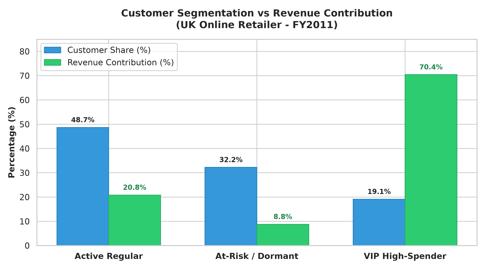
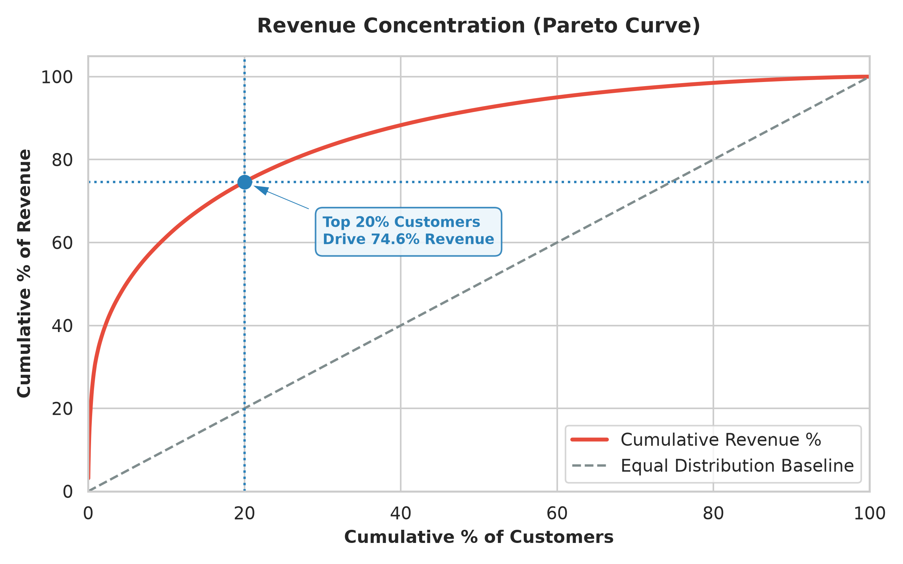

# E-Commerce Customer Retention & Value Segmentation

A data analytics project analyzing customer purchasing patterns, repeat buyer behavior, and revenue concentration across 397,884 transactions from a UK online retailer.

Public Dataset Source: Kaggle - E-Commerce Data by Carrie (UCI Machine Learning Repository)
https://www.kaggle.com/datasets/carrie1/ecommerce-data

## 1. Executive Summary & Key Visuals

### Customer Segmentation vs Revenue Contribution


### Revenue Concentration (Pareto Curve)


## 2. Core Business Findings

1. High Repeat Buyer Base:
   - 65.58% of all customers (2,845 customers) are repeat buyers, contributing to 94.2% of total transaction volume.
   - One-time buyers account for 34.42% (1,493 customers), indicating an opportunity for post-first-purchase nurturing.

2. VIP Revenue Concentration:
   - 19.11% of customers (829 VIP High-Spenders) generate 70.42% of total gross revenue (£6.28M) with an average spend of £7,569.74 and 12.2 orders per customer.
   - The top 20% of customers drive 74.59% of total company revenue, verifying the 80/20 Pareto principle.

3. At-Risk / Dormant Opportunity:
   - 32.23% of customers (1,398 customers) have not placed an order in the last 90 days.
   - Action: Target dormant accounts with order history >= 2 before churn becomes permanent.

## 3. Performance Metrics Overview

- Total Gross Revenue: £8,911,407.90 (cleaned FY2011 retail sales volume)
- Total Transactions Analyzed: 397,884 (cleaned orders with positive quantity and price)
- Total Unique Customers: 4,338 distinct customer accounts
- Repeat Customer Rate: 65.58% (2,845 customers with at least 2 purchases)
- One-Time Buyer Rate: 34.42% (1,493 single-purchase accounts)
- Top 20% Revenue Share: 74.59% (revenue concentration in loyal buyers)
- VIP Revenue Contribution: 70.42% (core driver for retention strategy)

## 4. Customer Segmentation Model

Customers are classified into three operational tiers based on purchase frequency, recency, and monetary value:

- VIP High-Spender (19.1% customers / 70.4% revenue):
  High cumulative spend (>= £2,000) with multiple orders (>= 3).
  Average spend: £7,569.74. Average orders: 12.2.

- Active Regular (48.7% customers / 20.8% revenue):
  Recent purchase within the last 90 days.
  Average spend: £879.06. Average orders: 2.9.

- At-Risk / Dormant (32.2% customers / 8.8% revenue):
  Inactive with no purchases in over 90 days.
  Average spend: £558.22. Average orders: 1.7.

## 5. SQL Implementation Snippets

### Customer Segmentation Query (sql/02_customer_segmentation.sql)
```sql
WITH customer_summary AS (
    SELECT 
        customer_id,
        COUNT(DISTINCT invoice_no) AS total_orders,
        SUM(total_amount) AS total_spend,
        CAST(JULIANDAY('2011-12-10') - JULIANDAY(MAX(invoice_date)) AS INTEGER) AS recency_days
    FROM transactions
    GROUP BY customer_id
),
segmented AS (
    SELECT 
        customer_id, total_orders, total_spend, recency_days,
        CASE 
            WHEN total_spend >= 2000 AND total_orders >= 3 THEN 'VIP High-Spender'
            WHEN recency_days <= 90 THEN 'Active Regular'
            ELSE 'At-Risk / Dormant'
        END AS segment
    FROM customer_summary
)
SELECT 
    segment,
    COUNT(customer_id) AS customer_count,
    ROUND(100.0 * COUNT(customer_id) / (SELECT COUNT(*) FROM segmented), 2) AS pct_customers,
    ROUND(SUM(total_spend), 2) AS total_revenue,
    ROUND(100.0 * SUM(total_spend) / (SELECT SUM(total_spend) FROM segmented), 2) AS pct_revenue,
    ROUND(AVG(total_spend), 2) AS avg_spend,
    ROUND(AVG(total_orders), 1) AS avg_orders
FROM segmented
GROUP BY segment
ORDER BY total_revenue DESC;
```

## 6. Project Artifacts & Deliverables

- Visual Reports: output/customer_segments.png, output/revenue_pareto.png
- Executive Spreadsheet: output/ecommerce_executive_report.xlsx
- SQL Analysis Scripts: sql/01_repeat_buyer_analysis.sql, sql/02_customer_segmentation.sql, sql/03_revenue_pareto.sql
- Database: data/ecommerce.db
